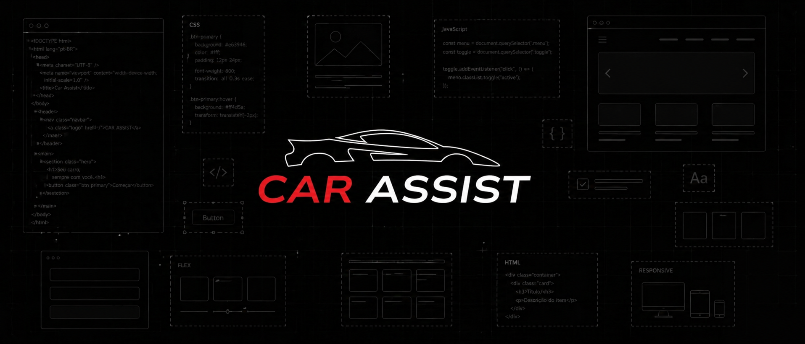

# Car Assist



Repositório frontend do projeto de Teste de Conclusão de Curso do curso de Desenvolvimento de Sistemas.  
Para mais informações, acessar o repositório principal: [Car Assist](https://github.com/Bre01cc/Car-Assist.git)

## Tecnologias
- React 18.3.1
- Vite 8.0.6
- JavaScript

## Bibliotecas
- lucide-react
- react-router-dom
- axios

## Como rodar

```bash
npm install
npm run dev